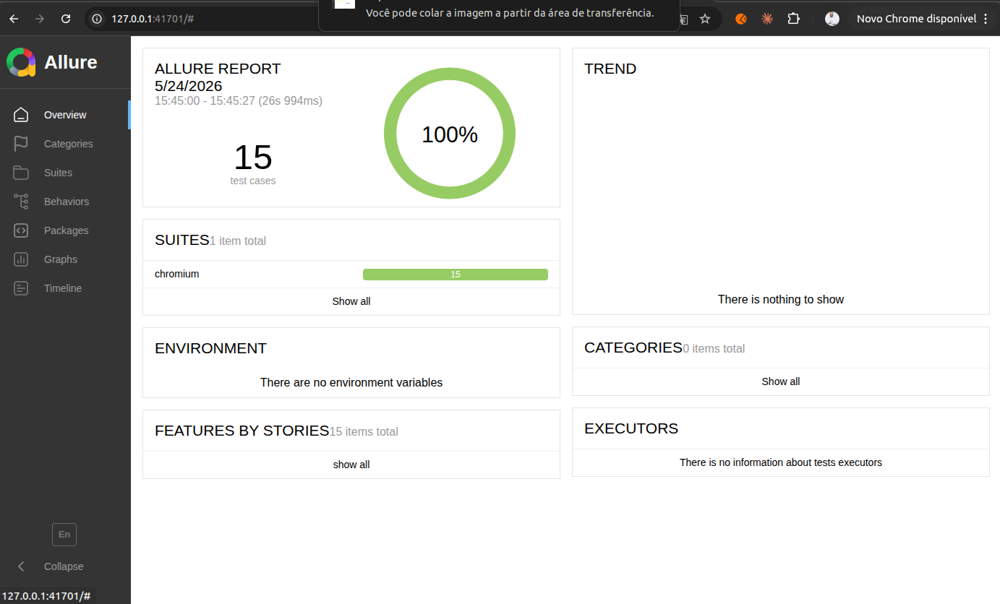
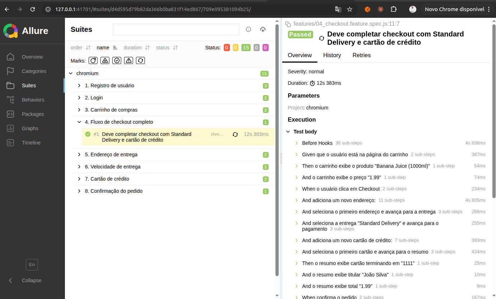

# Playwright OWASP Juice Shop — Automação de Testes E2E

Suite de testes end-to-end para a aplicação [OWASP Juice Shop](https://owasp.org/www-project-juice-shop/), construída com **Playwright** + **BDD (Cucumber/Gherkin)** + **Page Object Model**, com relatórios gerados pelo **Allure**.

---

## Sumário

1. [Visão Geral](#1-visão-geral)
2. [Stack de Tecnologia](#2-stack-de-tecnologia)
3. [Arquitetura do Projeto](#3-arquitetura-do-projeto)
4. [Pré-requisitos](#4-pré-requisitos)
5. [Como Executar Localmente](#5-como-executar-localmente)
6. [Execução por Ambiente](#6-execução-por-ambiente)
7. [Cenários de Teste](#7-cenários-de-teste)
8. [Relatórios de Teste](#8-relatórios-de-teste)

---

## 1. Visão Geral

Este projeto valida os principais fluxos funcionais do Juice Shop — uma aplicação web intencionalmente vulnerável usada como referência para testes de segurança e qualidade. Os testes cobrem desde o cadastro de usuário até a confirmação de pedido, passando por carrinho, endereço, entrega e pagamento.

A suite foi desenhada com dois pilares:

| Pilar | Objetivo |
|---|---|
| **BDD** | Cenários legíveis por todas as partes — QA, Dev, Produto |
| **Page Object Model** | Encapsular seletores e ações, facilitando manutenção |

---

## 2. Stack de Tecnologia

| Ferramenta | Versão | Papel |
|---|---|---|
| [Playwright](https://playwright.dev) | 1.60 | Engine de automação de browser |
| [playwright-bdd](https://github.com/vitalets/playwright-bdd) | 8.5 | Integração Gherkin com Playwright Test runner |
| [@cucumber/cucumber](https://github.com/cucumber/cucumber-js) | 12.9 | Parser Gherkin e tipo `DataTable` |
| [allure-playwright](https://allurereport.org) | 3.9 | Reporter Allure para Playwright |
| [allure-commandline](https://www.npmjs.com/package/allure-commandline) | 2.41 | CLI para geração do HTML do relatório |
| TypeScript | (via @types/node) | Tipagem estática em todos os arquivos |
| Docker | — | Sobe o Juice Shop em ambiente isolado |

---

## 3. Arquitetura do Projeto

```
.
├── config/
│   └── environments.ts              # Configuração de ambientes (local, staging)
│
├── features/                        # Cenários em linguagem Gherkin
│   ├── 01_registro.feature
│   ├── 02_login.feature
│   ├── 03_carrinho.feature
│   ├── 04_checkout.feature
│   ├── 05_endereco.feature
│   ├── 06_entrega.feature
│   ├── 07_cartao.feature
│   └── 08_confirmacao.feature
│
├── tests/
│   ├── pages/                       # Page Objects (um por página da aplicação)
│   │   ├── BasePage.ts              # Classe base: dismissWelcomeBanner()
│   │   ├── RegisterPage.ts
│   │   ├── LoginPage.ts
│   │   ├── HomePage.ts
│   │   ├── BasketPage.ts
│   │   ├── AddressSelectPage.ts
│   │   ├── AddressCreatePage.ts
│   │   ├── DeliveryMethodPage.ts
│   │   ├── PaymentPage.ts
│   │   ├── OrderSummaryPage.ts
│   │   └── OrderConfirmationPage.ts
│   │
│   ├── steps/                       # Step definitions (Given / When / Then)
│   │   ├── common.steps.ts          # Steps reutilizados entre features
│   │   ├── registro.steps.ts
│   │   ├── login.steps.ts
│   │   └── carrinho.steps.ts
│   │
│   └── support/
│       ├── fixtures.ts              # Ponto de composição: exporta test, Given/When/Then e helpers
│       ├── data/
│       │   ├── constants.ts         # PASSWORD, DEFAULT_ADDRESS, DEFAULT_CARD
│       │   └── factories.ts         # uniqueEmail()
│       └── api/
│           └── users.api.ts         # createUserViaApi()
│
├── .features-gen/                   # Gerado automaticamente pelo playwright-bdd (gitignore)
├── allure-results/                  # Gerado pelos testes (gitignore)
├── allure-report/                   # Gerado pelo CLI Allure (gitignore)
└── playwright.config.ts             # Configuração central do Playwright
```

### Page Object Model

Cada página da aplicação tem sua própria classe que encapsula seletores e ações. Locators internos são declarados como `private get`, expondo apenas a interface pública necessária. `BasePage` fornece `dismissWelcomeBanner()`, chamado no `goto()` de cada página.

```
BasePage  ←  RegisterPage, LoginPage, HomePage, BasketPage ...
```

### BDD com playwright-bdd

```
features/*.feature
    ↓  bddgen (gerado automaticamente durante o test run)
.features-gen/*.spec.js
    ↓  playwright test
resultado com Allure + HTML report
```

### Fixtures — separação de responsabilidades

O diretório `tests/support/` está organizado por responsabilidade:

| Módulo | Responsabilidade |
|---|---|
| `fixtures.ts` | Ponto de composição: registra page objects e re-exporta helpers |
| `data/constants.ts` | Dados fixos de teste (senha, endereço, cartão) |
| `data/factories.ts` | Geração de dados dinâmicos (`uniqueEmail`) |
| `api/users.api.ts` | Chamadas à API do Juice Shop (criação de usuário) |

### Configuração de ambientes

A URL base é controlada pela variável `TEST_ENV`. A lógica fica em `config/environments.ts` e é lida pelo `playwright.config.ts` em tempo de execução.

---

## 4. Pré-requisitos

- **Node.js** 18+ e **npm**
- **Docker** (para subir o Juice Shop localmente)
- Java 17+ (apenas para gerar o relatório Allure — não necessário para rodar os testes)

---

## 5. Como Executar Localmente

### 1. Instalar dependências

```bash
npm ci
npx playwright install --with-deps chromium
```

### 2. Subir o Juice Shop com Docker

```bash
docker run --rm -d -p 3006:3000 --name juice-shop bkimminich/juice-shop
```

Aguarde a aplicação estar pronta (a API de produtos deve responder antes de rodar os testes):

```bash
curl -s http://127.0.0.1:3006/api/Products | grep -q '"status":"success"' && echo "Pronto"
```

> **Importante:** os testes falharão com timeout de navegação se o Juice Shop não estiver rodando. Confirme que o `curl` acima retorna "Pronto" antes de executar.

### 3. Executar os testes

```bash
# Todos os cenários BDD
npm test

# Com saída detalhada no terminal
npm test -- --reporter=list

# Uma feature específica
npm test -- --grep "Carrinho"

# Um cenário específico
npm test -- --grep "deve completar checkout"

# Com interface gráfica (útil para debug)
npm run test:headed
```

### 4. Gerar o relatório Allure

```bash
npm run report
```

Ou manualmente:

```bash
npx allure generate allure-results --clean -o allure-report
npx allure open allure-report
```

### 5. Parar o Juice Shop

```bash
docker stop juice-shop
```

---

## 6. Execução por Ambiente

O ambiente é selecionado pela variável `TEST_ENV`. Os ambientes disponíveis e suas URLs estão definidos em [config/environments.ts](config/environments.ts).

| Ambiente | Variável | Comando |
|---|---|---|
| Local (padrão) | `TEST_ENV=local` | `npm test` ou `npm run test:local` |
| Staging | `TEST_ENV=staging` | `npm run test:staging` |

Para adicionar um novo ambiente, edite `config/environments.ts`:

```typescript
// config/environments.ts
const configs: Record<Environment, EnvConfig> = {
  local: { baseURL: 'http://127.0.0.1:3006' },
  staging: { baseURL: 'http://staging.juice-shop.example.com' },
  // adicione aqui:
  // homolog: { baseURL: 'http://homolog.juice-shop.example.com' },
};
```

E adicione o tipo correspondente:

```typescript
export type Environment = 'local' | 'staging'; // | 'homolog'
```

---

## 7. Cenários de Teste

| # | Feature | Cenários | Técnica de Setup |
|---|---|---|---|
| 1 | Registro de usuário | Sucesso · E-mail duplicado · Senhas diferentes | UI |
| 2 | Login | Credenciais válidas · Credenciais inválidas | API (`POST /api/Users/`) |
| 3 | Carrinho de compras | Adicionar produto · Visualizar carrinho | API + UI |
| 4 | Checkout completo (E2E) | Endereço + entrega + pagamento + confirmação | API + UI |
| 5 | Endereço de entrega | Criar endereço · Celular inválido | API + UI |
| 6 | Velocidade de entrega | Listar opções · Habilitar botão | API + UI |
| 7 | Cartão de crédito | Adicionar cartão · Sem pagamento selecionado | API + UI |
| 8 | Confirmação do pedido | Fluxo completo até confirmação | API + UI |

**Total: 15 cenários**

### Estratégia de independência

Cada cenário cria seu próprio usuário via API (`POST /api/Users/`) antes de iniciar. Isso garante:

- Zero dependência entre testes
- Execução paralela segura (`fullyParallel: true`)
- Nenhum cenário falha por herdar estado corrompido de outro

---

## 8. Relatórios de Teste

### Allure Report (principal)

```bash
npm run report
```

Organiza resultados por Feature > Cenário > Step, com screenshots e vídeos em caso de falha.

**Overview — dashboard de resultado geral:**



**Suites — navegação por Feature > Cenário > Step (visão Gherkin):**



### Playwright HTML Report

```bash
npx playwright show-report playwright-report
```

Útil para inspecionar o **trace viewer** integrado: reproduz cada step com DOM snapshot, network e console.
